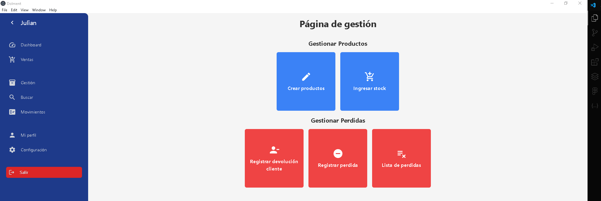
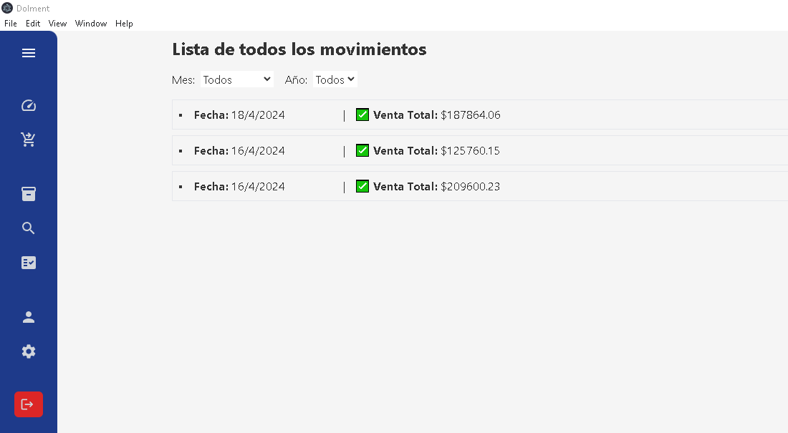

# Dolment

🚀 Sistema de gestión gratuito para todo el mundo 🌍

## Tecnologías principales

- Electron
- React
- Tailwind CSS
- MySQL

## Algunas imagenes

## Instalación

1. **Descargar Laragon**: Descarga e instala [Laragon](https://laragon.org/download/) en tu sistema.

2. **Iniciar Laragon y configurar la base de datos**:
   - Inicia Laragon y asegúrate de que el servidor de base de datos esté activo.
   - Importa el archivo `Creacion de tablas BD.sql` en tu gestor de base de datos para crear las tablas necesarias.

3. **Descargar Dolment**:
   - Descarga el programa Dolment desde [este enlace](https://drive.google.com/drive/folders/1CLC2lVUn2hv8CxFIt0IFGPFkWnQ6Oolo?usp=sharing).
   - Extrae el archivo descargado en la ubicación deseada en tu sistema.

4. **Iniciar Dolment**:
   - Ejecuta el archivo ejecutable de Dolment para iniciar el sistema.
   - ¡Listo! Ahora puedes comenzar a utilizar Dolment para gestionar tu información.
